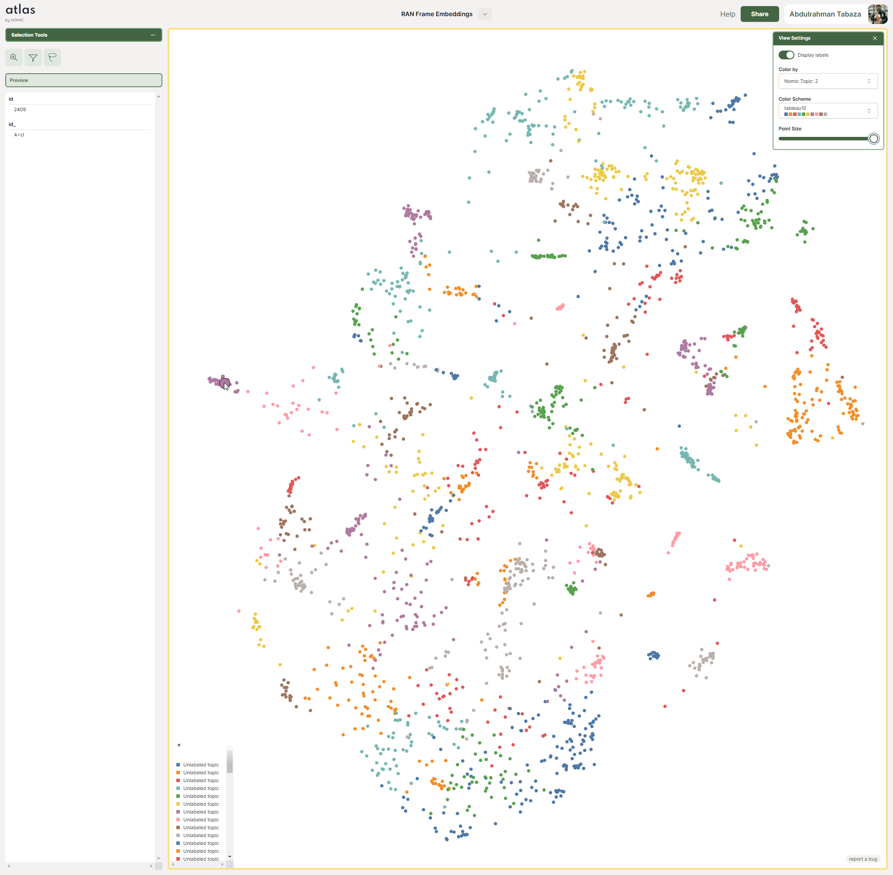

# DINOv2 Features for Frame Retrieval

This is a really simple thing I did where I embedded the frames from RAN 1985 by Akira Kurosawa into a latent space using DINOv2. I then used the latent space to retrieve frames from the movie. The results are pretty cool.

I ran the code on the cloud, so the streamlit UI I had to pretend to embed each frame query by just looking up the embedding through the file name. x10 stuff you wouldn't get it.

# Atlas Nomic Map
Atlas by [Nomic](nomic.ai) is a pretty cool tool that lets you vizualise embeddings, the other alternative is [Embeddings Projector](https://projector.tensorflow.org/) by Tensorflow. I used Atlas because it works. 

You can check out the maps right here: [Atlas Map](https://atlas.nomic.ai/map/e33cd03e-8506-424b-9396-3af8bca88919/c1e65fda-0cc7-4cd3-b699-b7419ca58c8e?xs=-6.28156&xf=52.26656&ys=-32.13484&yf=36.38420)

This is what the map looks like:

The clusters are meaningful, meaning that if you check one cluster, you might find frames that are similar to each other.